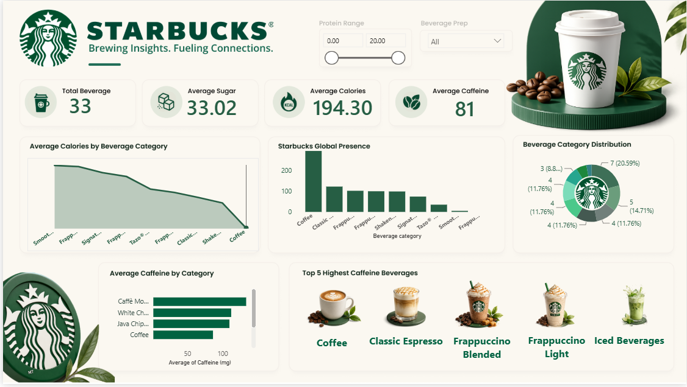

# Starbucks Beverage Analysis Dashboard – Power BI

## 📊 Project Overview

This project presents an interactive **Starbucks Beverage Analysis Dashboard** built using **Microsoft Power BI**.

The dashboard analyzes Starbucks beverage data to understand calorie, sugar, protein, caffeine, and beverage-category patterns through interactive visualizations and filters.

## 🎯 Business Objective

The objective of this project is to analyze beverage characteristics and provide an easy-to-understand dashboard for comparing different Starbucks beverage categories.

Key areas of analysis include:

- Beverage category analysis
- Average calories
- Average sugar content
- Average caffeine content
- Protein range analysis
- Beverage preparation types
- Top 5 highest-caffeine beverages

## 🛠️ Tools & Technologies

- **Power BI**
- **Power Query**
- **DAX**
- **Microsoft Excel / CSV**

## 📌 Dashboard Features

### Key Performance Indicators

- Total Beverages
- Average Sugar
- Average Calories
- Average Caffeine

### Interactive Filters

- Protein Range
- Beverage Preparation

### Visualizations

- Average Calories by Beverage Category
- Beverage Category Distribution
- Average Caffeine by Category
- Top 5 Highest Caffeine Beverages

## 📈 Key Insights

The dashboard helps identify:

- Differences in calorie levels across beverage categories
- Variation in caffeine content between categories
- Beverage categories with higher average caffeine
- The highest-caffeine beverages in the dataset
- How beverage preparation and protein levels can be explored interactively

## 📂 Files Included

| File | Description |
|---|---|
| `Starbucks_analysis.pbix` | Power BI dashboard and data model |
| `starbucks.csv` | Starbucks beverage dataset |
| `directory.csv` | Supporting Starbucks dataset |

## 🚀 Project Outcome

This project demonstrates practical skills in:

- Data cleaning and transformation
- Data modeling
- DAX calculations
- Interactive dashboard development
- KPI creation
- Data visualization
- Business-oriented data analysis

## 📊 Dashboard Preview

## 👤 Author

**Saninder Singh**
